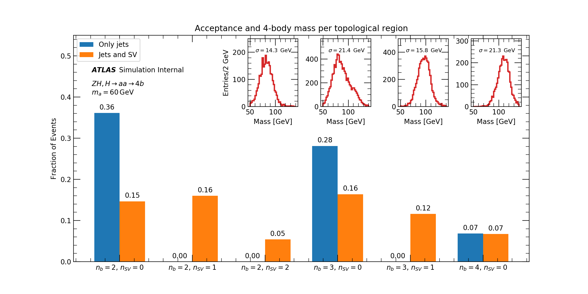

# How to run

## Pre-requesites

```
pip install numpythia --user
pip install pyjet --user
pip install scikit-hep --user
pip install particle --user
```

You also need numpy, pandas, ...

## How to generate events

```
python generate_findB.py [number of events] [rng seed]
```

The output will be called data_secvtx_[seed].h5, and the dataframe is stored with key *cats*.

## How to draw

```
python draw_findB.py [h5 file]
```

## Pythia configuation and example run

The Pythia configuration is set on [decay_findB.cmnd](https://github.com/rafaellopesdesa/H4b_softSV/blob/master/decay_findB.cmnd). There you can set:

- Pythia tune: currently ATLAS A14 (line *Tune:pp*)
- a-boson mass: currently 60 GeV (line *36:m0*, you should also set *36:mMin* and *36:mMax*)

There is an example run with this setup in `data_secvtx_100.h5` with 50k events. The corresponding draw output is below:




